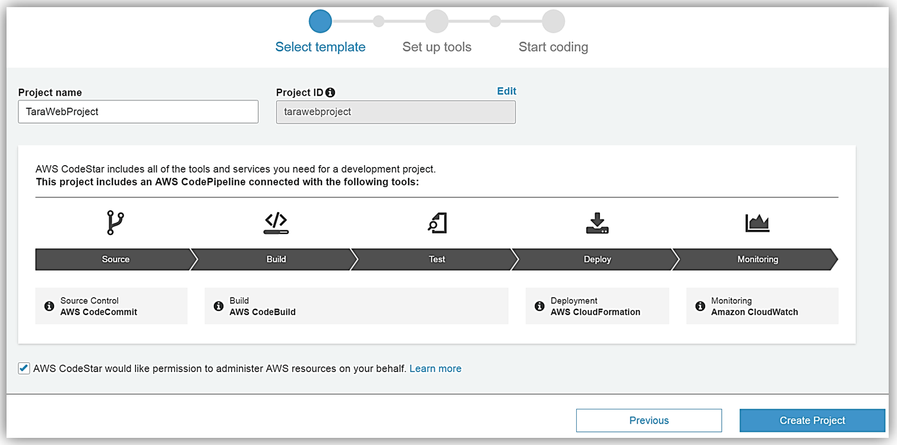

## AWS CodeStar
##### AWS Washington DC Meetup, 23-Aug-2017
dougtoppin@gmail.com

<a target="_blank" href="https://www.meetup.com/AWS-Washington-DC-Meet-Up/">https://www.meetup.com/AWS-Washington-DC-Meet-Up/</a>

<a target="_blank"  href="https://github.com/dougtoppin/presentation-aws-codestar">github.com/dougtoppin/presentation-aws-codestar</a>

---

## Agenda

* What is CodeStar
* What does it provision
* How does it work
* Why use it
* What it does not do
* When is it appropriate to use
* Can you modify resources using CodeStar
* Links
* Demo

---
### What is CodeStar

AWS service providing templates to provision all resources required for creating, building, deploying and monitoring applications for various architectures

+++
### What does it provision

* CodeCommit - git repository
* CodeBuild - build service
* CodePipeline - CI/CD
* CodeDeploy (EC2, Elastic Beanstalk, Lambda) - code deployment
* CloudWatch - logging/monitoring
* IAM - roles, policies

+++

+++
### How does it work

* CloudFormation - very capable automated repeatable provisioning (break the habit of using the admin console, do not launch instances, instead create autoscaling groups)
---
#### Why use it

Reduces
* time required to provision
* expertise required to provision
* expertise required to start monitoring
* time/expertise required to de-provision

+++
#### Provides a reference
* fully configured and working tool chain
* various languages supported (Java, JavaScript, PHP, Ruby, C#, Python)
* serverless resource examples
* API Gateway and Lambda coupling

+++
#### Customize
* modify template to suit your needs

+++
#### Issues
* project deletion does not always delete S3 CodeStar buckets that were created

---
### What it does not do

* templates do not cover all possible architecture cases
* cannot create a CodeStar template

---
### When is it appropriate to use

---

### Can you modify resources using CodeStar

---
### Links
* https://aws.amazon.com/codestar/

---
### Demo

(play desktop recording of a provisioning session here, pause at points to describe and discuss)
